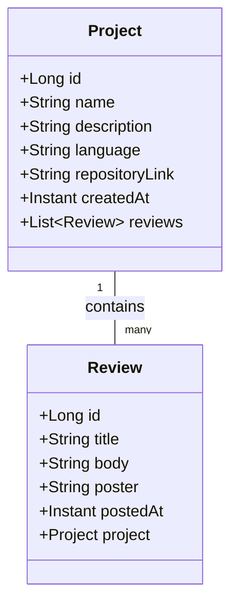

# Repophant Backend

## About

This project is the Backend repository for the blazingly fast and secure Repophant application using Spring Boot. :fire: :fire:

- [Frontend GitHub repository](https://github.com/Ohjelmistoprojekti-2-repophant/frontend)
- [Project backlog](https://github.com/orgs/Ohjelmistoprojekti-2-repophant/projects/1/views/1)
- [Software Project 2 course](https://hh-ohjelmistoprojekti-2.github.io/)

## Features

- Add projects or create new projects to start collaborating
- Search through projects that are looking for new collaborators
- Secure OAuth2 authentication with GitHub
- RESTful API with OpenAPI documentation
- PostgreSQL database integration

## Project Structure

## Tools

- **Backend Framework**: Spring Boot 3.4.1
- **Database**: PostgreSQL
- **Authentication**: OAuth2 with GitHub
- **API Documentation**: OpenAPI 3.0, API documentation at `http://localhost:8080/swagger-ui.html`
- **Testing**: JUnit 5, Mockito

## Team

- [Veera Virtanen](https://github.com/Beanie-bean)
- [Sara Hyvärinen](https://github.com/sarahyvarinen)
- [Mark Mäkelä](https://github.com/MarMakHH)
- [Kasper Snellman](https://github.com/bgz848)
- [Juuso Karjanlahti](https://github.com/juusokarjanlahti/)
