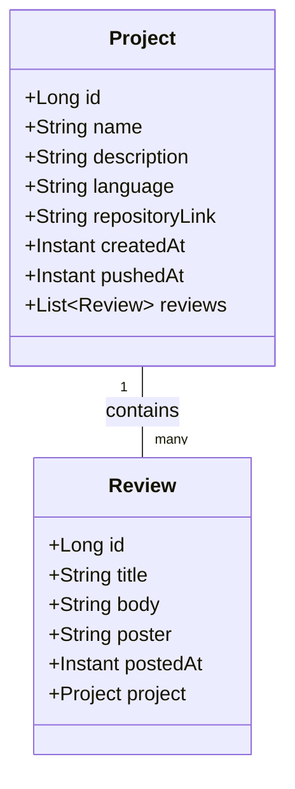

# Repophant Backend


This project is the Backend repository for the blazingly fast and secure Repophant application using Spring Boot. :fire: :fire:

- [Frontend GitHub repository](https://github.com/Ohjelmistoprojekti-2-repophant/frontend)
- [Project backlog](https://github.com/orgs/Ohjelmistoprojekti-2-repophant/projects/1/views/1)
- [Software Project 2 course](https://hh-ohjelmistoprojekti-2.github.io/)

## Features

- Browse and add projects that are looking for new collaborators
- Secure OAuth2 authentication with GitHub
- PostgreSQL database integration

## Data structure



## Prerequisites

- **Java** 21

## Installation

```
git clone https://github.com/Ohjelmistoprojekti-2-repophant/backend.git
cd backend
./mvnw spring-boot:run
```

## REST API

The REST API has Swagger documentation (accessible when the server is running). `http://localhost:8080/swagger-ui/index.html`
  
## Testing

Run all the tests in the same directory where the pom.xml is

```java
./mvnw test
```

## Style and formatting

This project uses the [Spotless Maven plugin](https://github.com/diffplug/spotless/tree/main/plugin-maven) to format Java code according to the [Google Java Style Guide](https://google.github.io/styleguide/).

Spotless is not enforced in CI and won't block commits or builds.
To check and apply formatting manually use:
```java
./mvnw spotless:check
```
```java
./mvnw spotless:apply
```

## Team

- [Veera Virtanen](https://github.com/Beanie-bean)
- [Sara Hyvärinen](https://github.com/sarahyvarinen)
- [Mark Mäkelä](https://github.com/MarMakHH)
- [Kasper Snellman](https://github.com/bgz848)
- [Juuso Karjanlahti](https://github.com/juusokarjanlahti/)
